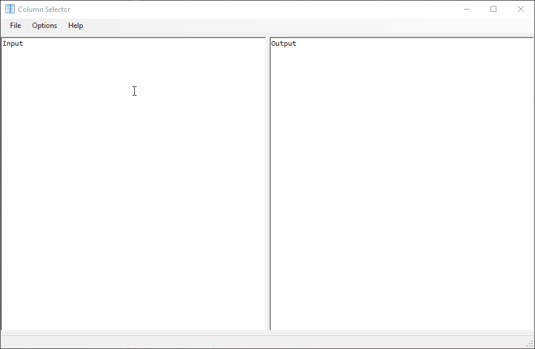
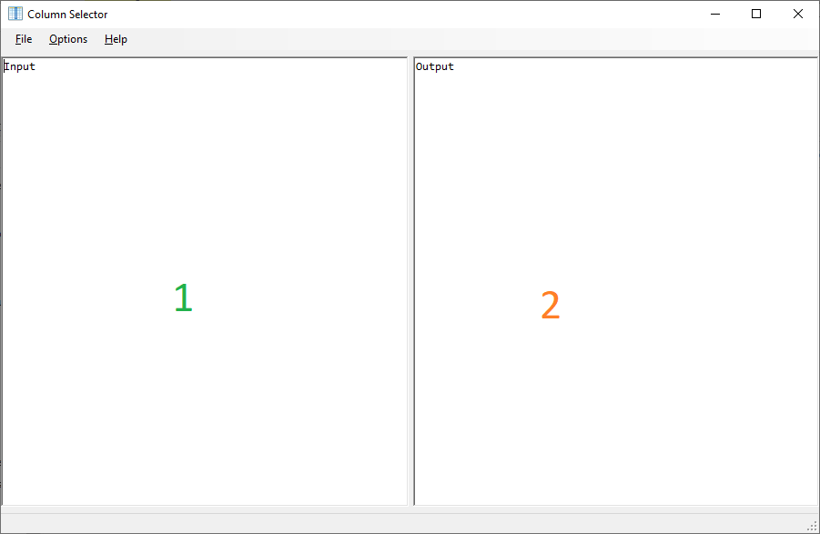

# ColumnSelector
A simple program to select a particular column of data.

This program was written at a time I was dealing with a lot of tabular data that was being given to me in a tab delimited format. I had the need to extract certain columns of this data and was using Excel a lot to perform this. However I did not like how Excel would attempt to format data that was pasted into it. Therefore I created this utility program to perform this task.

## Basic Usage
Here is a GIF of this in action:

The program is pretty straight forward; there are 2 "Panels" numbered in the following screenshot:

1. This is `Input`
2. This is `Output`

You can paste either a tab delimited plain text snippet or paste directly from Excel (or any rich text editor that has a grid) in the `Input` panel. Each input should be separated by a newline character for your operating system. Depending on the options chosen the `Output` panel will be the operation.

Selecting `Options->Column Options` or using its hotkey (`CTRL+TAB`) will bring up a dialog that asks for the zero based index of the column to select (defaulting to `0`).

This can also sort output and filter to distinct (case sensitive). The output dialogs can also be word wrapped when needed.

## Bugs/Feature Requests
I accept pull requests and am responsive on GitHub, let me know!

## Hacking
Historically this was a .NET Framework Application, as time has progressed I have converted it to .NET Core. However it still uses Windows Forms for its UI. This means this is a Windows Only application until I can be bothered to use a Cross Platform UI Toolkit.

## License
This is licensed under the MIT License.
