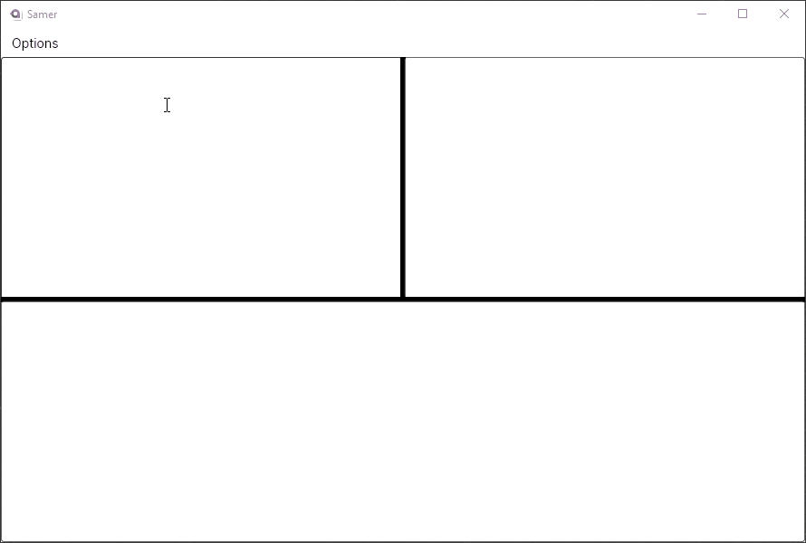
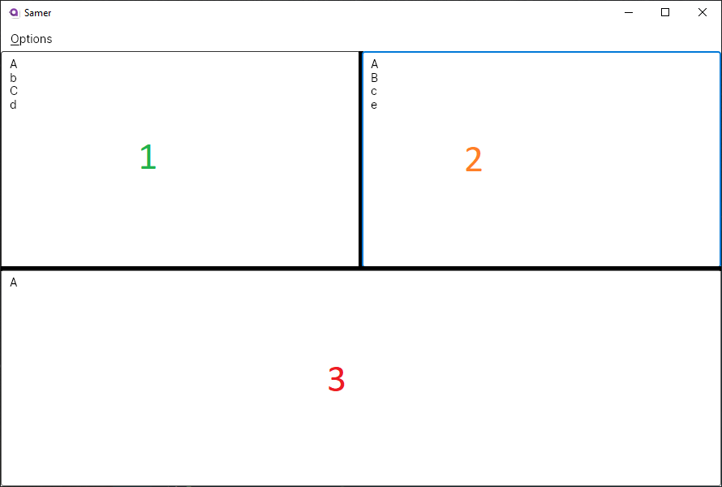

# Samer
A simple program to filter two similar outputs against each other.

This program was written to help me at work (and home), wherein I found myself in need of a quick way to see the difference between two outputs and [WinMerge](https://winmerge.org/?lang=en) was not quite what I needed.

## Basic Usage
Here is a GIF of this in action:

The program is pretty straight forward; there are three "Panels" numbered in the following screenshot:

1. This is `Left`
2. This is `Right`
3. This is `Output`

You can paste any plain text in either the `Left` or `Right` panel. Each input should be separated by a newline character for your operating system. Depending on the options chosen the `Output` panel will be the operation.

## Bugs/Feature Requests
I accept pull requests and am responsive on GitHub, let me know!

## Hacking
This was my first attempt at using Avalonia and .NET Core to try and get a cross platform tool. I am sure someone with more familiarity in this framework could fix this up, but this is lo-fi much like my other tools (Manipulative Replacer and Sorter).

## License
This is licensed under the MIT License.
