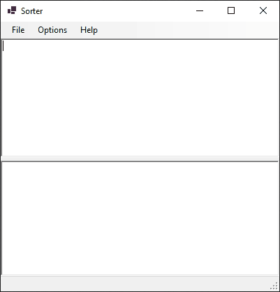
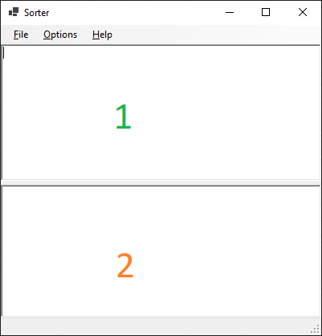

# Sorter
A simple program to sort a list, optionally removing duplicates from the list.

This program was written to help me at work (and home), wherein I found myself in need of a quick way to sort lists and remove duplicates without having to do this via Excel or PowerShell.

## Basic Usage
Here is a GIF of this in action:

The program is pretty straight forward; there are 2 "Panels" numbered in the following screenshot:

1. This is `Input`
2. This is `Output`

You can paste any plain text in the `Input` panel. Each input should be separated by a newline character for your operating system. Depending on the options chosen the `Output` panel will be the operation.

## Bugs/Feature Requests
I accept pull requests and am responsive on GitHub, let me know!

## Hacking
Historically this was a .NET Framework Application, as time has progressed I have converted it to .NET Core. However it still uses Windows Forms for its UI. This means this is a Windows Only application until I can be bothered to use a Cross Platform UI Toolkit.

## License
This is licensed under the MIT License.
